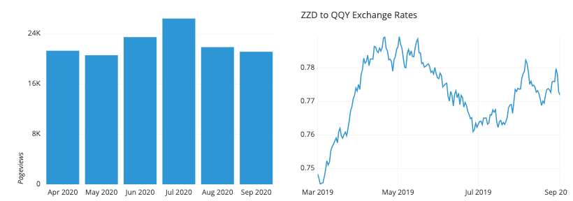
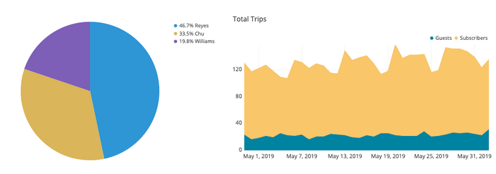
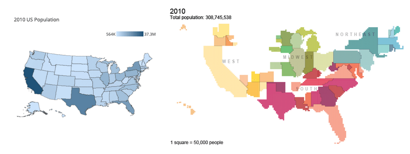

## Choosing the right method of Visualisation

Data visualisations are an essential element of data analysis because they effectively summarise large datasets in graphical formats. Numerous chart types are available, each with distinct strengths and suitable use cases. One of the most challenging aspects of the analysis process is selecting the appropriate visualisation to represent your data.

In this article, we will guide you on choosing the right data visualisation based on the specific task you aim to accomplish.

Common purposes for data visualisation include:

- Displaying changes over time
- Illustrating part-to-whole relationships
- Examining data distribution
- Comparing values across groups
- Exploring relationships between variables
- Mapping geographical data

The types of variables you are analysing and the intended audience for the visualisation also influence which chart is most effective for each purpose. Some visualisations can serve multiple functions depending on these factors.

# Time Based data

One of the most frequent uses of data visualisation is to observe how a variable's value changes over time. Typically, these charts display time on the horizontal axis, progressing from left to right, and the variable's values on the vertical axis. There are various methods to represent these values visually.

>

- Bar charts represent values through the heights of bars extending from a baseline.
- Line charts depict values by the vertical positions of points connected by line segments, which is particularly useful when a baseline is irrelevant or when plotting too many   bars would be impractical.
- Box plots are effective for illustrating the distribution of values over each time period; each box and whisker set indicates the range where most data points are concentrated.

Specialised charts are used in the financial domain, such as the candlestick chart or the Kagi chart.

## Displaying divides in data
Sometimes, we need to understand not just the total value, but also the components that make up that total. While standard bar charts can be used to compare the values of the components, the following charts emphasise the part-to-whole decomposition.

>

- The pie chart and its variant, the donuts chart, represent the whole as a circle divided into slices to show the parts.
- A stacked bar chart modifies a bar chart by dividing each bar into multiple sub-bars, illustrating the part-to-whole composition within each bar.
- Similarly, a stacked area chart modifies a line chart by shading the area under the lines to divide the total into subgroup values.
- There are also more complex chart types designed to display hierarchical relationships, such as the Marimekko plot and the treemap.

## Charts to help evaluating your data

An important use of visualisations is to show how data points are distributed. This is particularly useful during the exploration phase when trying to understand the properties of data features.

>

- Bar charts are used for qualitative variables that take on discrete values.
- Histograms are used for quantitative variables with numeric values.
- A density curve can serve as an alternative to a histogram, providing a smoothed estimate of the underlying distribution.
- Violin plots compare numeric value distributions between groups by displaying a density curve for each group.
- Box plots also compare distributions between groups but summarize the data with key statistics rather than showing an estimated distribution shape.

## Comparison charts

Another common application of data visualisation is comparing values between distinct groups. This is often combined with other visualisation purposes, such as displaying changes over time or examining data distribution.

>

- Bar charts compare values between groups by assigning a bar to each group.
- Dot plots serve a similar purpose, but indicate values with point positions instead of bar lengths. This is like a line chart without the connecting segments, useful when a vertical baseline is not meaningful.
- Line charts compare values between groups over time by plotting one line per group.
- Grouped bar charts allow for comparison across two different grouping variables by plotting multiple bars at each location.
- Violin plots and box plots are used to compare data distributions between groups.
- Funnel charts are specialised for showing how quantities move through a process, such as tracking how many visitors progress from seeing an ad to making a purchase.
- Bullet charts compare a true value to one or more benchmarks.

A sub-category of charts compares values between groups for multiple attributes, including parallel coordinates plots (and their special case, slope plots) and dumbbell plots.

## Evaluating between variables

Another common task in data exploration is understanding the relationships between data features. The following chart types can be used to plot two or more variables against each other to observe trends and patterns.

>

- The scatter plot is the standard method for illustrating the relationship between two variables.
- Scatter plots can incorporate additional variables by using colour, shape, or size for each point, as seen in a bubble chart.
- When time serves as a third variable, scatter plot points can be connected with line segments to create a connected scatter plot.
- An alternative for incorporating a temporal third variable is a dual-axis plot, such as combining a line chart and bar chart with a shared horizontal axis.
- When one or both variables are non-numeric, a heat map can depict relationships between groups. Heat maps are also useful for purely numeric data, akin to a 2D histogram or 2D density curve.

## Geographical data

At times, datasets include geographical information such as latitude and longitude, or regions like countries or states. While visualising this data may involve simply overlaying existing visualisations onto a map background (such as plotting points similar to a scatter plot on a map), there are other chart types designed specifically for geographical mapping. Two notable examples are discussed below

>

- A choropleth map resembles a heat map but colours geopolitical regions instead of a grid.
- Cartograms use the size of each region to encode value, requiring some distortion in shapes and topology.


