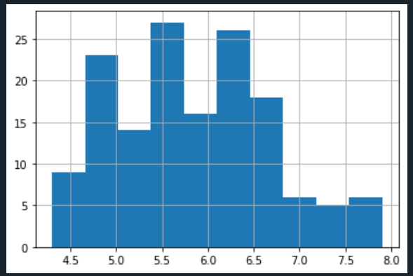
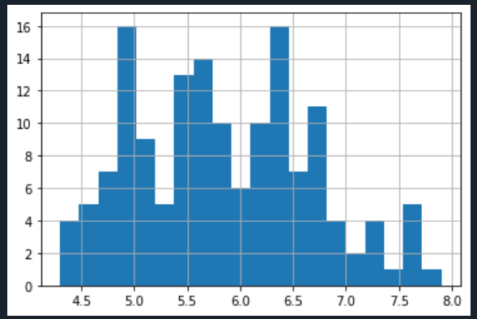
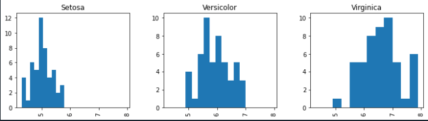
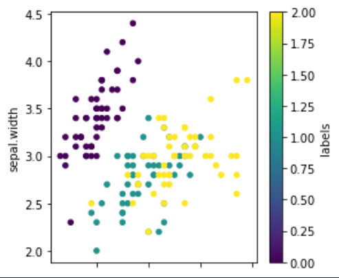
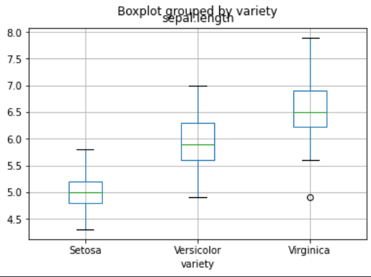
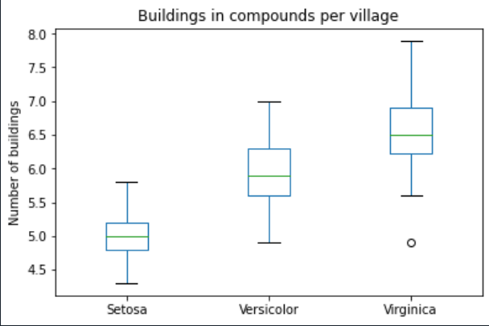
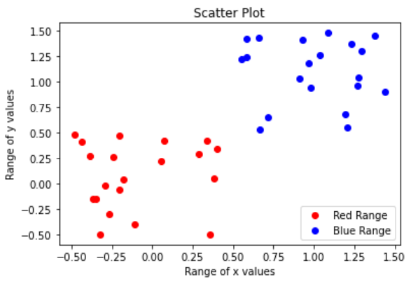
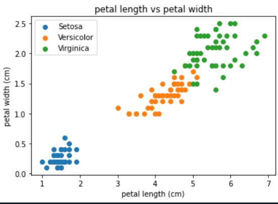

# Plotting in Python

There is a wide variety of ways to plot in Python, like many programming languages. Some do more of the design work for you and others let you customize the look of the plots and all of the little details yourself. Pandas has basic plots built into it that reduce the amount of syntax, if your data is already in a DataFrame. Matplotlib. is a Python graphical library that can be used to produce a variety of different graph types, it is fully controllable down to basic elements and includes a module pylab that is somewhere in between (designed to feel like MATLAB plotting, if you happen to have done that before).

The Matplotlib library can be imported using any of the import techniques we have seen. As Pandas is generally imported with import pandas as pd, you will find that Matplotlib is most commonly imported with import matplotlib as plt where ‘plt’ is the alias.

In addition to importing the library, in a Jupyter notebook environment we need to tell Jupyter that when we produce a graph, we want it to be display the graph in a cell in the notebook just like any other results. To do this we use the %matplotlib inline directive.

Although we are using Matplotlib in this episode, Pandas can make use of several other graphical libraries available from within Python such as ggplot2 and Seaborn. Seaborn has some very powerful features and advanced plot types. One of its most useful features is formatting.

## Plotting with Pandas

The Pandas library contains very tight integration with Matplotlib. There are functions in Pandas that automatically call Matplotlib functions to produce graphs.

To plot with Pandas we have to import it as we have done in past episodes. To tell Jupyter that when we produce a graph we want it to be displayed in a cell in the notebook just like any other results, we use the %matplotlib inline directive. Without that we need to do a show() command.

~~~
import pandas as pd
%matplotlib inline
~~~
{: .language-python}

We also need data to work with loaded into a DataFrame and it’s helpful to look at a few rows to remember what’s there.

We are going to use the dataset from the setup page, SAFI_full_shortname.csv. For the data to load, make sure to have that file in the same folder where your Jupyter notebook is running. If the file is not in that folder, you are going to have to type the full path.

~~~
df_iris = pd.read_csv("iris.csv")
df_iris.head()
~~~
{: .language-python}

## Histogram Plot

Next, we can plot the a histogram of a variable.

~~~
df_iris['sepal.length'].hist()
~~~
{: .language-python}

>
{: .output}

We can change the number of bins to make it look how we would like, for example

~~~
df_iris['sepal.length'].hist(bins=20)
~~~
{: .language-python}
>
{: .output}

Lets try layout, figsize, and sharex.

~~~
df_iris.hist(column='sepal.length',by='variety',layout=(1,3),figsize=(12,3),sharex=True)
~~~
{: .language-python}

>
{: .output}

## Scatter Plot

The scatter plot requires the x and y coordinates of each of the points being plotted. We can add a third dimension as different colors with the c argument.

~~~
df_iris['labels'] = df_iris.variety.astype('category').cat.codes
df_iris.plot.scatter(x='sepal.length', y='sepal.width', c='labels', colormap="viridis", figsize=[4,4])
~~~
{: .language-python}

>
{: .output}

## Boxplot

A boxplot provides a simple representation of a variety of statistical qualities of a single set of data values. A common use of the boxplot is to compare the statistical variations across a set of variables.

The variables can be an independent series or columns of a Dataframe using the Pandas plot method

~~~
df_iris.boxplot(by ='variety',column=['sepal.length'])
~~~
{: .language-python}

>
{: .output}

The automatic title of the plot does not look good, we are missing a title for the y-axis and we do not need the extra x-axis title. We can also remove the gridlines. Let’s fix these things using functions from plt. Note: all the adjustments for the plot have to go into the same notebook cell together with the plot statement itself.

~~~
df_iris.boxplot(by ='variety',column=['sepal.length'])
plt.suptitle('') # remove the automatic title
plt.title('Buildings in compounds per village')   # add a title
plt.ylabel('Number of buildings')   # add a y-axis title
plt.xlabel('')   # remove the x-axis title
plt.grid(None)   # remove the grid lines
~~~
{: .language-python}

>
{: .output}

In general most graphs can be broken down into a series of elements which, although typically related in some way, can all exist independently of each other. This allows us to create the graph in a rather piecemeal fashion. The labels (if any) on the x and y axis are independent of the data values being represented. The title and the legend are also independent objects within the overall graph. In matplotlib you create the graph by providing values for all of the individual components you choose to include.

# Plotting with Matplotlib separately

We can further customise our plots with Matplotlib directly. First we need to import it. The Matplotlib library can be imported using any of the import techniques we have seen. As Pandas is generally imported with import pandas as pd, you will find that matplotlib is most commonly imported with import matplotlib.pyplot as plt where plt is the alias. For demonstration purposes, we are going to use randomly generated data, using the NumPy library (aliased here as np).

~~~
import numpy as np
import pandas as pd
import matplotlib.pyplot as plt

# Generate some date for 2 sets of points.
x1 = pd.Series(np.random.rand(20) - 0.5)
y1 = pd.Series(np.random.rand(20) - 0.5)

x2 = pd.Series(np.random.rand(20) + 0.5)
y2 = pd.Series(np.random.rand(20) + 0.5)

# Add some features
plt.title('Scatter Plot')
plt.ylabel('Range of y values')
plt.xlabel('Range of x values')

# plot the points in a scatter plot
plt.scatter(x1, y1, c='red', label='Red Range')  # 'c' parameter is the colour and 'label' is the text for the legend
plt.scatter(x2, y2, c='blue', label='Blue Range')

plt.legend(loc=4)  # the locations 1,2,3 and 4 are top-right, top-left, bottom-left and bottom-right
# Show the graph with the two sets of points
plt.show()
~~~
{: .language-python}

>
{: .output}

In the call to the scatter method, the label parameter values are used by the legend. The c or color parameter can be set to any color Matplotlib recognises. Full details of the available colours are available in the Matplotlib website. The markers section will tell you what markers you can use instead of the default ‘dots’. There is also an s (size) parameter which allows you to change the size of the marker.

# Improving our initial scatter plot

The problem with our previous scatter plot was that we had to convert the labels to numbers to display them, which resulted in a confusing colour scale. By using Matplotlib directly, we can now plot the labels as they are.

~~~
sp = iris_df.drop_duplicates(subset=['variety'])
sp = list(sp['variety'])
print(iris_df.head())
for opt in sp:
    subset_df = iris_df[iris_df['variety'] == opt ]
    plt.scatter(subset_df['petal.length'], subset_df['petal.width'], 
                label =opt)

plt.xlabel('petal length (cm)')
plt.ylabel('petal width (cm)')
plt.title('petal length vs petal width')
plt.legend()
~~~
{: .language-python}

>
{: .output}

# Saving a Graph

If you wish to save your graph as an image you can do so using the plt.savefig() function. The image can be saved as a pdf, jpg or png file by changing the file extension. plt.savefig() needs to be called at the end of all your plot statements in the same notebook cell.

~~~
df_iris.boxplot(by ='variety',column=['sepal.length'])
plt.suptitle('') # remove the automatic title
plt.title('Buildings in compounds per village')   # add a title
plt.ylabel('Number of buildings')   # add a y-axis title
plt.xlabel('')   # remove the x-axis title
plt.grid(None)   # remove the grid lines
plt.savefig('sepal_boxplot.pdf')   # save as pdf file
plt.savefig('sepal_boxplot.png', dpi = 150)  # save as png file, some extra arguments are provided
~~~
{: .language-python}

In general most graphs can be broken down into a series of elements which, although typically related in some way, can all exist independently of each other. This allows us to create the graph in a rather piecemeal fashion.

The labels (if any) on the x and y axis are independent of the data values being represented. The title and the legend are also independent objects within the overall graph.

In Matplotlib you create the graph by providing values for all of the individual components you choose to include. When you are ready, you call the show function.

Using this same approach we can plot two sets of data on the same graph. We will use a scatter plot to demonstrate some of the available features.


