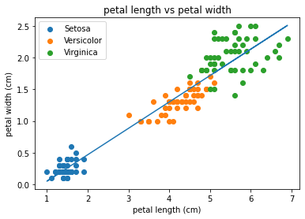

# Linear regression

We will now create a basic linear model for a given dataset. It would be valuable to assess the accuracy of this model. One way to achieve this is by computing the predicted y-values for each x-value in our original dataset and comparing them with the actual y-values. We can aggregate these individual discrepancies into a single comprehensive error metric by calculating the least squares. This involves squaring each difference, summing them all, dividing the sum by the total number of observations, and then taking the square root of the result. By squaring and subsequently taking the square root, we prevent negative errors from offsetting positive ones, thus providing us with an overall error metric to gauge the accuracy of our model.


## Preprocess the dataset

Any easy way to calculate our intercepts is to use least squares fit. 
~~~
import matplotlib.pyplot as plt
import pandas as pd
from scipy import stats
iris_df = pd.read_csv("iris.csv")

slope, intercept, r, p, std_err = stats.linregress(iris_df['petal.length'], iris_df['petal.width'])

def myfunc(x):
  return slope * x + intercept

mymodel = list(map(myfunc, iris_df['petal.length']))
print(intercept)
~~~
{: .language-python}
~~~
Intercept X
-0.3630755
~~~
{: .output}

So now we have our intercepts, lets plot our line of best fit to our data.
~~~
sp = iris_df.drop_duplicates(subset=['variety'])
sp = list(sp['variety'])
print(iris_df.head())
for opt in sp:
    subset_df = iris_df[iris_df['variety'] == opt ]
    plt.scatter(subset_df['petal.length'], subset_df['petal.width'], 
                label =opt)


plt.xlabel('petal length (cm)')
plt.ylabel('petal width (cm)')
plt.title('petal length vs petal width')
plt.plot(iris_df['petal.length'], mymodel)
plt.legend()
plt.show() 
~~~
{: .language-python}

>
{: .output}

So lets now have ago at building a linear model instead using "lm"
~~~
import matplotlib.pyplot as plt
import pandas as pd
from sklearn.linear_model import LinearRegression

import numpy as np


iris_df = pd.read_csv("iris.csv")

from sklearn.model_selection import train_test_split

iris_df['labels'] = iris_df.variety.astype('category').cat.codes


y= iris_df['petal.length']


iris_df = iris_df.drop(labels= 'petal.length', axis = 1)
iris_df = iris_df.drop(labels = 'variety', axis=1)

X_train, X_test, y_train, y_test = train_test_split(iris_df, y, test_size= 0.33, random_state= 101)
reg = LinearRegression().fit(X_train, y_train)

print(reg.intercept_)
~~~
{: .language-python}

~~~

-0.22183715030556383
~~~
{: .output}

lets predict a measure for petal length using our linear model

~~~
reg.predict(X_test)
pred = reg.predict(X_test)

pred = reg.predict(X_test)
print('Predicted petal length (cm):', pred[0])
print('Actual petal length (cm):', 1.4)
~~~
{: .language-python}

~~~

Predicted petal length (cm): 1.37097289501913
Actual petal length (cm): 1.4
~~~
{: .output}

> ## Try different features
>
> Have ago at using the same code and trying with sepal instead of petal, or any combination.
>
{: .challenge}

# Logistic Regression
We’ve now seen how we can use linear regression to make a simple model and use that to predict values, but what do we do when the relationship between the data isn’t linear?

> ## Logarithms Introduction
> Logarithms are the inverse of an exponent (raising a number by a power).
> ```
> log b(a) = c
> b^c = a
> ```
> For example:
> ```
> 2^5 = 32
> log 2(32) = 5
> ```
> If you need more help on logarithms see the [Khan Academy's page](https://www.khanacademy.org/math/algebra2/exponential-and-logarithmic-functions/introduction-to-logarithms/a/intro-to-logarithms)
{: .callout}

This time instead of focusing on plotting, were going to use logistic regression as a classifier. First we need to prepossess our data set by splitting it into training and test data. Then we will apply logistic regression using the binomial family using the sepal length feature.

~~~
import matplotlib.pyplot as plt
import pandas as pd


import numpy as np


iris_df = pd.read_csv("iris.csv")

from sklearn.model_selection import train_test_split

# Splitting the dataset into the Training set and Test set
X = iris_df.iloc[:, :4]
y = iris_df.iloc[:, 4]

X_train, X_test, y_train, y_test = train_test_split(X, y, test_size = 0.25, random_state = 0)
from sklearn.preprocessing import StandardScaler
sc = StandardScaler()
X_train = sc.fit_transform(X_train)
X_test = sc.transform(X_test)


# Fitting Logistic Regression to the Training set
from sklearn.linear_model import LogisticRegression
classifier = LogisticRegression(random_state = 0, solver='lbfgs', multi_class='auto')
classifier.fit(X_train, y_train)
print(classifier)
~~~
{: .language-python}

~~~

LogisticRegression(random_state=0)
~~~
{: .output}

So we have now created our model and we want to predict some of the samples in our test set.
~~~
# Predicting the Test set results
y_pred = classifier.predict(X_test)
# Predict probabilities
probs_y=classifier.predict_proba(X_test)### Print results 
probs_y = np.round(probs_y, 2)
res = "{:<10} | {:<10} | {:<10} | {:<13} | {:<5}".format("y_test", "y_pred", "Setosa(%)", "versicolor(%)", "virginica(%)\n")
res += "-"*65+"\n"
res += "\n".join("{:<10} | {:<10} | {:<10} | {:<13} | {:<10}".format(x, y, a, b, c) for x, y, a, b, c in zip(y_test, y_pred, probs_y[:,0], probs_y[:,1], probs_y[:,2]))
res += "\n"+"-"*65+"\n"
print(res)
~~~
{: .language-python}

><pre style="color: black; background: white;">
>y_test     | y_pred     | Setosa(%)  | versicolor(%) | virginica(%)
>-----------------------------------------------------------------
>Virginica  | Virginica  | 0.0        | 0.03          | 0.97      
>Versicolor | Versicolor | 0.01       | 0.95          | 0.04      
>Setosa     | Setosa     | 1.0        | 0.0           | 0.0       
>Virginica  | Virginica  | 0.0        | 0.08          | 0.92      
>Setosa     | Setosa     | 0.98       | 0.02          | 0.0       
>Virginica  | Virginica  | 0.0        | 0.01          | 0.99      
>Setosa     | Setosa     | 0.98       | 0.02          | 0.0       
>Versicolor | Versicolor | 0.01       | 0.71          | 0.28      
>Versicolor | Versicolor | 0.0        | 0.73          | 0.27      
>Versicolor | Versicolor | 0.02       | 0.89          | 0.08      
>Virginica  | Virginica  | 0.0        | 0.44          | 0.56      
>Versicolor | Versicolor | 0.02       | 0.76          | 0.22      
>Versicolor | Versicolor | 0.01       | 0.85          | 0.13      
>Versicolor | Versicolor | 0.0        | 0.69          | 0.3       
>Versicolor | Versicolor | 0.01       | 0.75          | 0.24      
>Setosa     | Setosa     | 0.99       | 0.01          | 0.0       
>Versicolor | Versicolor | 0.02       | 0.72          | 0.26      
>Versicolor | Versicolor | 0.03       | 0.86          | 0.11      
>Setosa     | Setosa     | 0.94       | 0.06          | 0.0       
>Setosa     | Setosa     | 0.99       | 0.01          | 0.0       
>Virginica  | Virginica  | 0.0        | 0.17          | 0.83      
>Versicolor | Versicolor | 0.04       | 0.71          | 0.25      
>Setosa     | Setosa     | 0.98       | 0.02          | 0.0       
>Setosa     | Setosa     | 0.96       | 0.04          | 0.0       
>Virginica  | Virginica  | 0.0        | 0.35          | 0.65      
>Setosa     | Setosa     | 1.0        | 0.0           | 0.0       
>Setosa     | Setosa     | 0.99       | 0.01          | 0.0       
>Versicolor | Versicolor | 0.02       | 0.87          | 0.11      
>Versicolor | Versicolor | 0.09       | 0.9           | 0.02      
>Setosa     | Setosa     | 0.97       | 0.03          | 0.0       
>Virginica  | Virginica  | 0.0        | 0.21          | 0.79      
>Versicolor | Versicolor | 0.06       | 0.69          | 0.25      
>Setosa     | Setosa     | 0.98       | 0.02          | 0.0       
>Virginica  | Virginica  | 0.0        | 0.35          | 0.65      
>Virginica  | Virginica  | 0.0        | 0.04          | 0.96      
>Versicolor | Versicolor | 0.07       | 0.81          | 0.11      
>Setosa     | Setosa     | 0.97       | 0.03          | 0.0       
>Versicolor | Virginica  | 0.0        | 0.42          | 0.58      
>-----------------------------------------------------------------
></pre>
{: .output}

Looking at our results, the prediction val column give thew prediction confidence that said belongs to that class. typically in machine learning we use the 0.5 confidence threshold. Now lest have a look at what our chat looks like.


> ## trying different features
>
> Again have ago at using different features to see what changes in the prediction.
>
{: .challenge}



