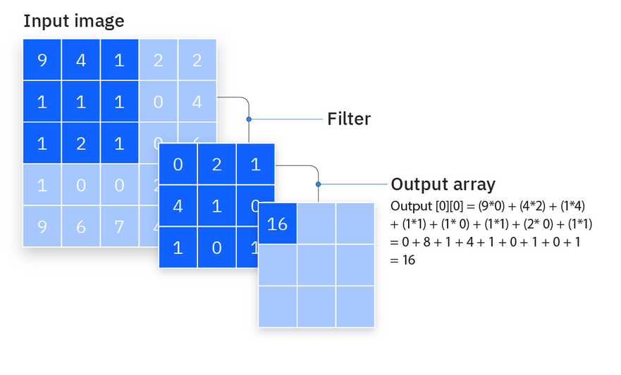
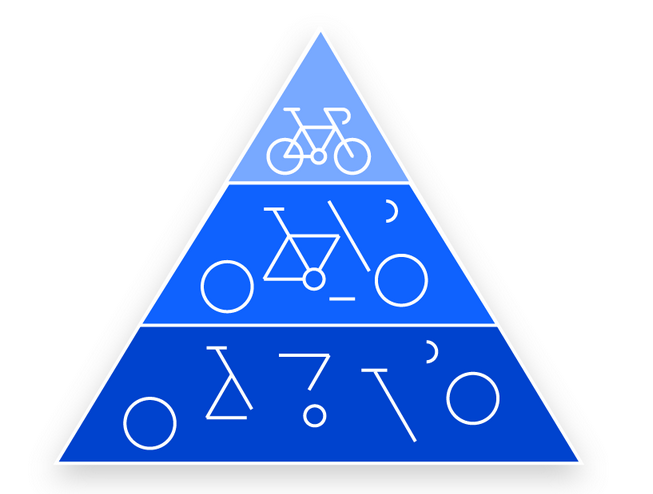

### Materials

All materials for this example can be downloaded with the following link: https://drive.google.com/drive/folders/1ebTP7DVQ89FNiezReAmqYW-l5IGxZYFw?usp=sharing

# How do Convolutional neural networks work?

Convolutional neural networks are distinguished from other neural networks by their superior performance with image, speech, or audio signal inputs. They have three main types of layers, which are:

- Convolutional layer
- Pooling layer
- Fully-connected (FC) layer

The convolutional layer is the first layer of a convolutional network. While convolutional layers can be followed by additional convolutional layers or pooling layers, the fully-connected layer is the final layer. With each layer, the CNN increases in its complexity, identifying greater portions of the image. Earlier layers focus on simple features, such as colors and edges. As the image data progresses through the layers of the CNN, it starts to recognize larger elements or shapes of the object until it finally identifies the intended object.

## Convolutional layer

The convolutional layer is the core building block of a CNN, and it is where the majority of computation occurs. It requires a few components, which are input data, a filter, and a feature map. Let’s assume that the input will be a color image, which is made up of a matrix of pixels in 3D. This means that the input will have three dimensions—a height, width, and depth—which correspond to RGB in an image. We also have a feature detector, also known as a kernel or a filter, which will move across the receptive fields of the image, checking if the feature is present. This process is known as a convolution.

The feature detector is a two-dimensional (2-D) array of weights, which represents part of the image. While they can vary in size, the filter size is typically a 3x3 matrix; this also determines the size of the receptive field. The filter is then applied to an area of the image, and a dot product is calculated between the input pixels and the filter. This dot product is then fed into an output array. Afterwards, the filter shifts by a stride, repeating the process until the kernel has swept across the entire image. The final output from the series of dot products from the input and the filter is known as a feature map, activation map, or a convolved feature.

Note that the weights in the feature detector remain fixed as it moves across the image, which is also known as parameter sharing. Some parameters, like the weight values, adjust during training through the process of backpropagation and gradient descent. However, there are three hyperparameters which affect the volume size of the output that need to be set before the training of the neural network begins. These include:

- The number of filters affects the depth of the output. For example, three distinct filters would yield three different feature maps, creating a depth of three. 

- Stride is the distance, or number of pixels, that the kernel moves over the input matrix. While stride values of two or greater is rare, a larger stride yields a smaller output.

- Zero-padding is usually used when the filters do not fit the input image. This sets all elements that fall outside of the input matrix to zero, producing a larger or equally sized output. There are three types of padding:

- Valid padding: This is also known as no padding. In this case, the last convolution is dropped if dimensions do not align.
- Same padding: This padding ensures that the output layer has the same size as the input layer.
- Full padding: This type of padding increases the size of the output by adding zeros to the border of the input.

After each convolution operation, a CNN applies a Rectified Linear Unit (ReLU) transformation to the feature map, introducing nonlinearity to the model.

## Additional convolutional layer

As we mentioned earlier, another convolution layer can follow the initial convolution layer. When this happens, the structure of the CNN can become hierarchical as the later layers can see the pixels within the receptive fields of prior layers.  As an example, let’s assume that we’re trying to determine if an image contains a bicycle. You can think of the bicycle as a sum of parts. It is comprised of a frame, handlebars, wheels, pedals, et cetera. Each individual part of the bicycle makes up a lower-level pattern in the neural net, and the combination of its parts represents a higher-level pattern, creating a feature hierarchy within the CNN. Ultimately, the convolutional layer converts the image into numerical values, allowing the neural network to interpret and extract relevant patterns.

## Pooling layer

Pooling layers, also known as downsampling, conducts dimensionality reduction, reducing the number of parameters in the input. Similar to the convolutional layer, the pooling operation sweeps a filter across the entire input, but the difference is that this filter does not have any weights. Instead, the kernel applies an aggregation function to the values within the receptive field, populating the output array. There are two main types of pooling:

- Max pooling: As the filter moves across the input, it selects the pixel with the maximum value to send to the output array. As an aside, this approach tends to be used more often compared to average pooling.
- Average pooling: As the filter moves across the input, it calculates the average value within the receptive field to send to the output array.

While a lot of information is lost in the pooling layer, it also has a number of benefits to the CNN. They help to reduce complexity, improve efficiency, and limit risk of overfitting. 

## Fully-connected layer

The name of the full-connected layer aptly describes itself. As mentioned earlier, the pixel values of the input image are not directly connected to the output layer in partially connected layers. However, in the fully-connected layer, each node in the output layer connects directly to a node in the previous layer.

This layer performs the task of classification based on the features extracted through the previous layers and their different filters. While convolutional and pooling layers tend to use ReLu functions, FC layers usually leverage a softmax activation function to classify inputs appropriately, producing a probability from 0 to 1.

## Prepare the dataset
~~~
import pandas as pd
import os 

import matplotlib.pyplot as plt
import numpy as np
import cv2

from sklearn.utils import shuffle

Dataset_folder = "cats_dogs"

"""
The format of the dataset is:
    --cats_dogs
        --train/test
            --cats/dogs
            
therefore this code loops over all the folders and
creates and excel sheet that has the labels of what each
image contains.
We make two columns, one being the path to the image
and the other is the label.

"""

Dataset_allocation = os.listdir(Dataset_folder)

for option in Dataset_allocation:
    data = pd.DataFrame()
    File_names = []
    File_paths = []
    Cats = []
    Dogs = []
    Class_path = os.path.join(Dataset_folder, option)
    Class_options = os.listdir(Class_path)
    for Class in Class_options:
        Imgs_path = os.path.join(Class_path,  Class)
        Imgs_list = os.listdir(Imgs_path)
        for img in Imgs_list:
            Img_path = os.path.join(Imgs_path, img)
            File_names.append(img)
            File_paths.append(Img_path)
            print(Class)
            if Class == "dogs":
                Dogs.append(1)
                Cats.append(0)
            else:
                Dogs.append(0)
                Cats.append(1)
    data["File_names"] = File_names
    data["File_paths"] = File_paths
    
    data["Dogs"] = Dogs
    data["Cats"] = Cats
    data = shuffle(data)
    
    data.to_excel("{}.xlsx".format(option))

~~~
{: .language-python}

## Dataloader

~~~
import numpy as np
import keras
from sklearn.utils import shuffle
import cv2
import imgaug.augmenters as iaa
import random

class DataGenerator(keras.utils.Sequence):
    'Generates data for Keras'
    def __init__(self, dataset, args, shuffle=False, augmentation=False):
        'Initialization'
        self.dataset = dataset
        self.args = args
        self.shuffle = shuffle
        self.augmentation = augmentation
        self.n = len(self.dataset)
        self.on_epoch_end()

    def __len__(self):
        'Denotes the number of batches per epoch'
        return int(np.floor(self.n / self.args.batch_size))

    def __getitem__(self, index):
        'Generate one batch of data'
        images = []
        labels = []
        # Generate indexes of the batch
        batches = self.dataset[index *self.args.batch_size:(index + 1) * self.args.batch_size]
        for ind in range(batches.shape[0]):
            img_path =  str(batches[self.args.image_paths_column].iloc[ind])
            image = self.__get_image(img_path)
            if self.augmentation:
                image = self.__apply_augmentation(image)
            images.append(image)
            # Generate data
            labels.append([batches[self.args.prediction_classes].iloc[ind].values])
        images = np.array(images, np.float32)
        labels = np.array(labels, np.int64)
        labels = np.squeeze(labels)
        return images, labels
    
    def __get_image(self, path):
        ## load image
        image = cv2.imread(path)
        
        image = cv2.resize(image, (self.args.img_size, self.args.img_size),interpolation=cv2.INTER_CUBIC)
        image = image/255.0
        return image
    
    def __apply_augmentation(self, image):
        random_number = random.randint(1, 5)
        if random_number == 1:
            image = self.__aug_flip_hr(image)
        elif random_number == 2:
            image = self.__aug_flip_vr(image)
        elif random_number == 3:
            image = self.__aug_rotation(image, 30)
        return image
        
        
        return image
    def __aug_flip_hr(self, img):
        hflip = iaa.Fliplr(p=1.0)
        img_hf = hflip.augment_image(img)

        return img_hf

    # Augmentation Vertical Flip
    def __aug_flip_vr(self, img):
        vflip = iaa.Flipud(p=1.0)
        img_vf = vflip.augment_image(img)

        return img_vf

    # Augmentation Rotation
    def __aug_rotation(self, img, rot_deg):
        rot1 = iaa.Affine(rotate=(-rot_deg, rot_deg))
        img_rot = rot1.augment_image(img)

        return img_rot
        

    def on_epoch_end(self):
        'Updates indexes after each epoch'
        if self.shuffle:
            self.dataset = shuffle(self.dataset)
            self.n = len(self.dataset)

~~~
{: .language-python}

~~~
import pandas as pd
import os 
import tensorflow as tf
from tensorflow import keras
import matplotlib.pyplot as plt
import numpy as np
import cv2
import argparse
from data_generator import DataGenerator
from tensorflow.keras import layers, Model
from tensorflow.keras.callbacks import TensorBoard, EarlyStopping, ModelCheckpoint, ReduceLROnPlateau
from sklearn.decomposition import PCA
import umap

parser = argparse.ArgumentParser()

###dataset options
parser.add_argument('--mode',type=str, default="train", help='train, inference, features')
parser.add_argument('--train_excel',type=str, default = "train.xlsx", help='name of training excel')
parser.add_argument('--test_excel',type=str, default = "test.xlsx", help='name of test excel')
parser.add_argument('--image_paths_column',type=str, default = "File_paths", help='column name in excel that detail image names')
parser.add_argument('-n' , '--prediction_classes', nargs='+', default =["Cats", "Dogs"])#, "Low"])
parser.add_argument('--validation_split', type=float, default=0.7, help='maximum epoch number to train')

### model parameters
parser.add_argument('--max_epochs', type=int, default=20, help='maximum epoch number to train')
parser.add_argument('--batch_size', type=int, default=16, help='batch_size per gpu')
parser.add_argument('--img_size', type=int,default=256, help='input patch size of network input')
parser.add_argument('--aug', default = False, help='do you want augmentation? true or false')
parser.add_argument('--img_colour', default = True, help='do you want to use colour')
parser.add_argument('--Starting_lr', type=float,  default=0.001,help='intial lr')
parser.add_argument('--Tensorboard_name', type=str, default="Tensorboard_model", help='name of weights file')
###output files

parser.add_argument('--weight_name', type=str, default="Cats_Dogs_model.h5", help='name of weights file')

args = parser.parse_args()
print(args)
if args.mode == "features":
    args.batch_size = 1

### open excel sheets in pandas
training_data = pd.read_excel(args.train_excel)
test_data = pd.read_excel(args.test_excel)

# find data split value
split_value = int(round(training_data.shape[0] * args.validation_split, 0))

train_data, validation_data = training_data.iloc[:split_value], training_data.iloc[split_value:]

print(train_data.shape, validation_data.shape, test_data.shape)

#### load images into dataloader

train_set = DataGenerator(train_data, args, shuffle=True, augmentation = True)
validation_set = DataGenerator(validation_data, args)
test_set = DataGenerator(test_data, args)

    

####Creating model

def Simple_model(args, filters = 32):
    if args.img_colour:
        N_channels = 3
    else:
        N_channels = 1
    inputA = layers.Input(shape=(args.img_size, args.img_size, N_channels))
    
    x = layers.Conv2D(filters, (7, 7), strides=(2, 2), activation='relu')(inputA)
    x = layers.BatchNormalization(momentum=0.1, epsilon=0.00001)(x)
    x = layers.MaxPooling2D((2, 2), strides=(2, 2))(x)
    x = layers.Conv2D(filters, (3,3), activation='relu')(x)
    x = layers.BatchNormalization(momentum=0.1, epsilon=0.00001)(x)
    x = layers.MaxPooling2D((2, 2))(x)
    x = layers.Conv2D(filters, (3,3), activation='relu')(x)
    x = layers.BatchNormalization(momentum=0.1, epsilon=0.00001)(x)
    x = layers.MaxPooling2D((2, 2))(x)
    dropout = layers.Dropout(0.3)(x)
    flattened = layers.Flatten()(dropout)
    fc1 = layers.Dense(args.img_size, activation="relu")(flattened)
    N = layers.BatchNormalization(momentum=0.1, epsilon=0.00001)(fc1)
    fc2 = layers.Dense(len(args.prediction_classes), activation="softmax")(N)
    model = Model(inputs=inputA, outputs=fc2)
    return model

model = Simple_model(args)

loss_fn = keras.losses.BinaryCrossentropy() ## binary loss function as there are two classes
optimizer = tf.keras.optimizers.Adam(learning_rate=args.Starting_lr) ##adam optimizer as it very robust
train_acc_metric = keras.metrics.BinaryAccuracy() ## two classes meaning binary accuracy, catigorical if more than 2
tensorboard = TensorBoard(log_dir= args.Tensorboard_name)
checkpointer = ModelCheckpoint(filepath=args.weight_name, monitor='val_binary_accuracy',mode='max', verbose = 1, save_best_only=True, save_weights_only = True)
callbacks = [tensorboard, checkpointer, ReduceLROnPlateau(monitor=('val_loss'), factor=0.8, patience=2, cooldown=0, min_lr=0.00000001, verbose=1)]
model.compile(loss=loss_fn, optimizer=optimizer, metrics=train_acc_metric)
if args.mode == "train":
    model.fit(train_set,validation_data=validation_set, use_multiprocessing=True, workers=6, epochs = args.max_epochs, callbacks = callbacks)
    model.save_weights(args.weight_name)
elif args.mode == "inference":
    model.load_weights(args.weight_name)
    model.evaluate(test_set)
elif args.mode == "features":
    model.load_weights(args.weight_name)
    features = []
    Extract = Model(model.inputs, model.layers[-3].output)
    data = pd.concat([training_data, test_data], axis=0)
    all_images = DataGenerator(data, args)
    for ii in range(0, data.shape[0]):
        image, label = all_images[ii]
        #image = np.squeeze(image)
        val_pred = Extract([image], training=False)
        features.append(val_pred)

    features = np.array(features)
    features = np.squeeze(features)
    print(features.shape)
    clusterable_embedding = umap.UMAP()
    cluster = clusterable_embedding.fit_transform(features)
    pca = PCA(n_components=2)
    cluster2 = pca.fit_transform(features)
    data["X_PCA_POSITIONS"] = cluster2[:, 0]
    data["Y_PCA_POSITIONS"] = cluster2[:, 1]
    data["X_UMAP_POSITIONS"] = cluster[:, 0]
    data["Y_UMAP_POSITIONS"] = cluster[:, 1]
    for item in args.prediction_classes:
        df2 = data[(data[item] == 1)]
        plt.scatter(df2["X_PCA_POSITIONS"],
                    df2["Y_PCA_POSITIONS"], label=item)
    plt.legend()
    plt.title("Pca")
    plt.savefig("Pca_features.png")
    plt.close()
    
    for item in args.prediction_classes:
        df2 = data[(data[item] == 1)]
        plt.scatter(df2["X_UMAP_POSITIONS"],
                    df2["Y_UMAP_POSITIONS"], label=item)
    plt.legend()
    plt.title("UMAP")
    plt.show()
    plt.savefig("UMAP_features.png")
    plt.close()
    
    
    data.to_excel("cats_dogs_features.xlsx")
    

~~~
{: .language-python}

><pre style="color: black; background: white;">
>149/157 [===========================>..] - ETA: 0s - loss: 0.5309 - sparse_categorical_accuracy: 0.7378   
>Epoch 1: sparse_categorical_accuracy improved from -inf to 0.74164, saving model to FordA_model.h5
>157/157 [==============================] - 11s 43ms/step - loss: 0.5225 - sparse_categorical_accuracy: 0.7416 - val_loss: 0.7063 - val_sparse_categorical_accuracy: 0.4851 - lr: 0.0010
>Epoch 2/20
>148/157 [===========================>..] - ETA: 0s - loss: 0.4094 - sparse_categorical_accuracy: 0.8264  
>Epoch 2: sparse_categorical_accuracy improved from 0.74164 to 0.82723, saving model to FordA_model.h5
>157/157 [==============================] - 7s 42ms/step - loss: 0.4061 - sparse_categorical_accuracy: 0.8272 - val_loss: 0.6463 - val_sparse_categorical_accuracy: 0.6726 - lr: 0.0010
>Epoch 3/20
>153/157 [============================>.] - ETA: 0s - loss: 0.3785 - sparse_categorical_accuracy: 0.8386  
>Epoch 3: sparse_categorical_accuracy improved from 0.82723 to 0.83718, saving model to FordA_model.h5
>157/157 [==============================] - 7s 42ms/step - loss: 0.3790 - sparse_categorical_accuracy: 0.8372 - val_loss: 0.9282 - val_sparse_categorical_accuracy: 0.5149 - lr: 0.0010
>Epoch 4/20
>149/157 [===========================>..] - ETA: 0s - loss: 0.3003 - sparse_categorical_accuracy: 0.8989  
>Epoch 4: sparse_categorical_accuracy improved from 0.83718 to 0.90207, saving model to FordA_model.h5
>157/157 [==============================] - 7s 42ms/step - loss: 0.2969 - sparse_categorical_accuracy: 0.9021 - val_loss: 0.3677 - val_sparse_categorical_accuracy: 0.8032 - lr: 0.0010
>Epoch 5/20
>152/157 [============================>.] - ETA: 0s - loss: 0.2772 - sparse_categorical_accuracy: 0.8984  
></pre>
{: .output}


