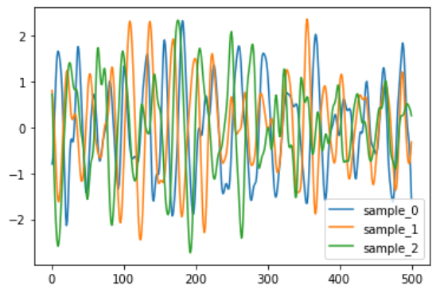

### Materials

All materials for this example can be downloaded with the following link: https://drive.google.com/drive/folders/15UI8jbgp_EOVParKWVtISaBjMgxtUD2v?usp=sharing

## Prepare the dataset
~~~
import pandas as pd
import os 

import matplotlib.pyplot as plt
import numpy as np
import cv2

from sklearn.utils import shuffle
from sklearn.model_selection import train_test_split
import string
import itertools

Path_to_train_txt = ["FordA_TRAIN.txt", "FordA_TEST.txt"]
for item in Path_to_train_txt:
    f = open(item, "r")
    data = pd.DataFrame()
    for x in f:
        split_string = x.split()
        cast_string = np.float_(split_string)
        create_array = np.array(cast_string)
        create_array = np.expand_dims(create_array, axis=0)
        frame = pd.DataFrame(create_array)
        data = pd.concat([data, frame])
    print(data.head())
    data.to_excel(item.replace(".txt", ".xlsx"))
~~~
{: .language-python}

## Dataloader

~~~
import numpy as np
from tensorflow import keras
from sklearn.utils import shuffle
import cv2
import imgaug.augmenters as iaa
import random

class DataGenerator(keras.utils.Sequence):
    'Generates data for Keras'
    def __init__(self, dataset, args, shuffle=False):
        'Initialization'
        self.dataset = dataset
        self.args = args
        self.shuffle = shuffle
        self.n = len(self.dataset)
        self.on_epoch_end()

    def __len__(self):
        'Denotes the number of batches per epoch'
        return int(np.floor(self.n / self.args.batch_size))

    def __getitem__(self, index):
        'Generate one batch of data'
        features = []
        labels = []
        # Generate indexes of the batch
        batches = self.dataset[index *self.args.batch_size:(index + 1) * self.args.batch_size]
        batch_labels = batches.copy()
        batch_labels = batch_labels[0]
        batches.drop(columns= batches.columns[0], axis=1, inplace=True)
        for ind in range(batches.shape[0]):
            feature = batches.iloc[ind]
            feature = np.expand_dims(feature, axis=1)
            features.append(feature)
            # Generate data
            if batch_labels.iloc[ind] == -1:
                labels.append([1])
            else:
                labels.append([0])
            
            
        features = np.array(features, np.float32)
        labels = np.array(labels, np.int64)
        labels = np.squeeze(labels)
        #labels = np.expand_dims(labels, axis=-1)
        return features, labels
    
        

    def on_epoch_end(self):
        'Updates indexes after each epoch'
        if self.shuffle:
            self.dataset = shuffle(self.dataset)
            self.n = len(self.dataset)
~~~
{: .language-python}

~~~
import pandas as pd
import os 
import tensorflow as tf
import keras
import matplotlib.pyplot as plt
import numpy as np
import cv2
import argparse
from data_generator import DataGenerator
from tensorflow.keras import layers, Model
from tensorflow.keras.callbacks import TensorBoard, EarlyStopping, ModelCheckpoint, ReduceLROnPlateau
import warnings
warnings.filterwarnings('ignore')
parser = argparse.ArgumentParser()

###dataset options
parser.add_argument('--mode',type=str, default="train", help='train, inference')
parser.add_argument('--train_excel',type=str, default = "FordA_TRAIN.xlsx", help='name of training excel')
parser.add_argument('--test_excel',type=str, default = "FordA_TEST.xlsx", help='name of test excel')
parser.add_argument('--image_paths_column',type=str, default = "File_paths", help='column name in excel that detail image names')
parser.add_argument('-n' , '--prediction_classes', nargs='+', default =[0,1])#, "Low"])
parser.add_argument('--validation_split', type=float, default=0.7, help='maximum epoch number to train')

### model parameters
parser.add_argument('--max_epochs', type=int, default=20, help='maximum epoch number to train')
parser.add_argument('--batch_size', type=int, default=16, help='batch_size per gpu')
parser.add_argument('--img_size', type=int,default=100, help='input patch size of network input')
parser.add_argument('--aug', default = False, help='do you want augmentation? true or false')
parser.add_argument('--img_colour', default = True, help='do you want to use colour')
parser.add_argument('--Starting_lr', type=float,  default=0.001,help='intial lr')
parser.add_argument('--Tensorboard_name', type=str, default="Tensorboard_model", help='name of weights file')
###output files

parser.add_argument('--weight_name', type=str, default="FordA_model.h5", help='name of weights file')

args = parser.parse_args()
print(args)
args.features_columns = 501

### open excel sheets in pandas
training_data = pd.read_excel(args.train_excel)
test_data = pd.read_excel(args.test_excel)

# find data split value
split_value = int(round(training_data.shape[0] * args.validation_split, 0))

train_data, validation_data = training_data.iloc[:split_value], training_data.iloc[split_value:]

print(train_data.shape, validation_data.shape, test_data.shape)

#### load images into dataloader

train_set = DataGenerator(train_data, args, shuffle=True)
validation_set = DataGenerator(validation_data, args)
test_set = DataGenerator(test_data, args)

####Creating model

def Simple_model(args, filters = 64):
    
    input_layer = layers.Input(shape=(args.features_columns,1))
    
    conv1 = keras.layers.Conv1D(filters=filters, kernel_size=3, padding="same")(input_layer)
    conv1 = keras.layers.BatchNormalization()(conv1)
    conv1 = keras.layers.ReLU()(conv1)

    conv2 = keras.layers.Conv1D(filters=filters, kernel_size=3, padding="same")(conv1)
    conv2 = keras.layers.BatchNormalization()(conv2)
    conv2 = keras.layers.ReLU()(conv2)

    conv3 = keras.layers.Conv1D(filters=filters, kernel_size=3, padding="same")(conv2)
    conv3 = keras.layers.BatchNormalization()(conv3)
    conv3 = keras.layers.ReLU()(conv3)

    gap = keras.layers.GlobalAveragePooling1D()(conv3)

    output_layer = keras.layers.Dense(len(args.prediction_classes), activation="softmax")(gap)

    return keras.models.Model(inputs=input_layer, outputs=output_layer)

model = Simple_model(args)

loss_fn = tf.keras.losses.SparseCategoricalCrossentropy()
acc_metric = tf.keras.metrics.SparseCategoricalAccuracy()
optimizer = tf.keras.optimizers.Adam(learning_rate=args.Starting_lr) ##adam optimizer as it very robust

tensorboard = TensorBoard(log_dir= args.Tensorboard_name)
checkpointer = ModelCheckpoint(filepath=args.weight_name, monitor='sparse_categorical_accuracy',mode='max', verbose = 1, save_best_only=True, save_weights_only = True)
callbacks = [tensorboard, checkpointer, ReduceLROnPlateau(monitor=('val_loss'), factor=0.8, patience=2, cooldown=0, min_lr=0.00000001, verbose=1)]
model.compile(loss=loss_fn, optimizer=optimizer, metrics=acc_metric)
if args.mode == "train":
    model.fit(train_set,validation_data=validation_set, use_multiprocessing=True, workers=6, epochs = args.max_epochs, callbacks = callbacks)
    model.save_weights(args.weight_name)
elif args.mode == "inference":
    model.load_weights(args.weight_name)
    model.evaluate(test_set)
elif args.features == "features":
    model.load_weights(args.weight_name)
    

~~~
{: .language-python}

><pre style="color: black; background: white;">
>149/157 [===========================>..] - ETA: 0s - loss: 0.5309 - sparse_categorical_accuracy: 0.7378   
>Epoch 1: sparse_categorical_accuracy improved from -inf to 0.74164, saving model to FordA_model.h5
>157/157 [==============================] - 11s 43ms/step - loss: 0.5225 - sparse_categorical_accuracy: 0.7416 - val_loss: 0.7063 - val_sparse_categorical_accuracy: 0.4851 - lr: 0.0010
>Epoch 2/20
>148/157 [===========================>..] - ETA: 0s - loss: 0.4094 - sparse_categorical_accuracy: 0.8264  
>Epoch 2: sparse_categorical_accuracy improved from 0.74164 to 0.82723, saving model to FordA_model.h5
>157/157 [==============================] - 7s 42ms/step - loss: 0.4061 - sparse_categorical_accuracy: 0.8272 - val_loss: 0.6463 - val_sparse_categorical_accuracy: 0.6726 - lr: 0.0010
>Epoch 3/20
>153/157 [============================>.] - ETA: 0s - loss: 0.3785 - sparse_categorical_accuracy: 0.8386  
>Epoch 3: sparse_categorical_accuracy improved from 0.82723 to 0.83718, saving model to FordA_model.h5
>157/157 [==============================] - 7s 42ms/step - loss: 0.3790 - sparse_categorical_accuracy: 0.8372 - val_loss: 0.9282 - val_sparse_categorical_accuracy: 0.5149 - lr: 0.0010
>Epoch 4/20
>149/157 [===========================>..] - ETA: 0s - loss: 0.3003 - sparse_categorical_accuracy: 0.8989  
>Epoch 4: sparse_categorical_accuracy improved from 0.83718 to 0.90207, saving model to FordA_model.h5
>157/157 [==============================] - 7s 42ms/step - loss: 0.2969 - sparse_categorical_accuracy: 0.9021 - val_loss: 0.3677 - val_sparse_categorical_accuracy: 0.8032 - lr: 0.0010
>Epoch 5/20
>152/157 [============================>.] - ETA: 0s - loss: 0.2772 - sparse_categorical_accuracy: 0.8984  
></pre>
{: .output}

## Analysis

~~~
import pandas as pd
import os 

import matplotlib.pyplot as plt
import numpy as np
import cv2

import string
import itertools

number_of_plot_sample = 3

Path_to_train = "FordA_TRAIN.xlsx"
training_data = pd.read_excel(Path_to_train)
backup_data = training_data.copy()
print(training_data.shape)
training_data.drop(columns= [training_data.columns[0], training_data.columns[1]], axis=1, inplace=True)
print(training_data.shape)
#training_data.plot()
for ii in range(0, number_of_plot_sample):
    sample = training_data.iloc[ii]
    sample.plot(label="sample_{}".format(ii))
plt.legend()
~~~
{: .language-python}


